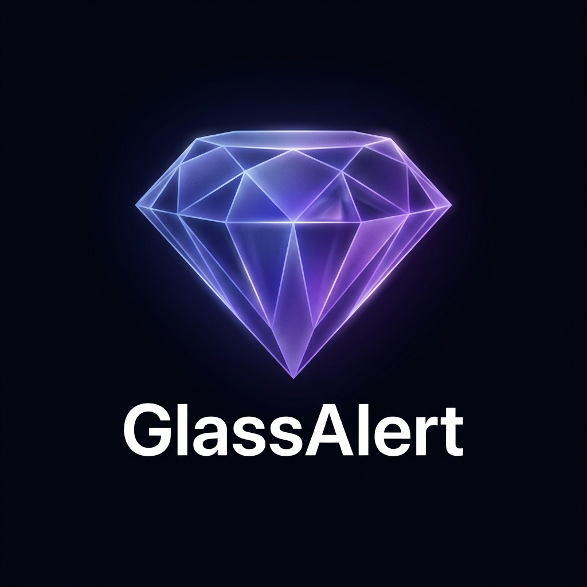

# GlassAlert Animation ✨

<p align="center">
  
</p>

<p align="center">
  <a href="https://www.npmjs.com/package/glass-alert-animation">
    
  </a>
  <a href="https://www.npmjs.com/package/glass-alert-animation">
    
  </a>
  <a href="https://github.com/jhonatalex/glass-alert/blob/main/LICENSE">
    
  </a>
  <a href="https://github.com/jhonatalex/glass-alert">
    
  </a>
</p>

---

**GlassAlert** is a premium, high-performance glassmorphism alert and modal library for React, powered by GSAP. Designed to be a high-end alternative to SweetAlert2, it focuses on modern "liquid glass" aesthetics, fluid animations, and interactive backgrounds.

### [🌐 Visit Live Documentation & Demos](https://jhonatalex.github.io/glass-alert/)

---

## ✨ Features

- 💎 **Premium Glassmorphism**: Stunning blur effects, translucent gradients, and luminous borders.
- 🚀 **GSAP-Powered Animations**: Hardware-accelerated transitions that feel smooth and professional.
- 🎨 **Dynamic Backgrounds**: Interactive, moving liquid gradient backgrounds for an "alive" feel.
- 📦 **Framework Ready**: Built for React with a simple hook-based API.
- 📱 **Mobile Optimized**: Fully responsive and lightweight.
- 🛠️ **Extremely Customizable**: Adjust blur, opacity, colors, and animation styles with ease.
- 🎭 **Lottie Support**: Built-in support for Lottie animations for success, error, and more.

## 🚀 Installation

```bash
npm install glass-alert-animation gsap lottie-react
```

> **Note:** `gsap` and `lottie-react` are required dependencies for the animations and icons.

## 📖 Quick Start

### 1. Setup the Provider

Wrap your application with the `GlassAlertProvider` and import the styles.

```tsx
import { GlassAlertProvider } from 'glass-alert-animation';
import 'glass-alert-animation/styles';

function App() {
  return (
    <GlassAlertProvider>
      <yourApp />
    </GlassAlertProvider>
  );
}
```

### 2. Trigger an Alert

Use the `useGlassAlert` hook to fire alerts anywhere in your components.

```tsx
import { useGlassAlert } from 'glass-alert-animation';

function MyComponent() {
  const { fire } = useGlassAlert();

  const handleAlert = async () => {
    const result = await fire({
      title: 'Success!',
      text: 'GlassAlert is working perfectly.',
      icon: 'success',
      glassColor: '#6366f1',
      animation: 'liquid'
    });
    
    if (result.isConfirmed) {
      console.log('User clicked OK');
    }
  };

  return <button onClick={handleAlert}>Show Alert</button>;
}
```

## ⚙️ Configuration Reference

| Property | Type | Default | Description |
| :--- | :--- | :--- | :--- |
| `title` | `string` | `''` | Main title header. |
| `theme` | `'light' \| 'dark'` | `'dark'` | Theme variant for the alert. |
| `text` | `string` | `''` | Body text content. |
| `html` | `ReactNode` | `undefined` | Custom HTML content (overrides text). |
| `icon` | `string` | `undefined` | `success`, `error`, `warning`, `info`, `question`. |
| `animation` | `string` | `'elastic'` | `elastic`, `bounce`, `slide`, `fade`, `liquid`. |
| `toast` | `boolean` | `false` | Enable toast notification mode. |
| `timer` | `number` | `0` | Auto-dismiss timer in ms. |
| `glassBlur` | `number` | `20` | Blur intensity for the glass effect (px). |
| `glassOpacity` | `number` | `0.12` | Opacity of the background (0-1). |
| `glassColor` | `string` | `'#6366f1'` | Primary glass accent color. |
| `glassColorSecondary` | `string` | `'#8b5cf6'` | Secondary color for gradients. |
| `confirmButtonColor` | `string` | `'#6366f1'` | Custom color for confirm button. |
| `cancelButtonColor` | `string` | `'#ffffff'` | Custom color for cancel button. |
| `denyButtonColor` | `string` | `'#ef4444'` | Custom color for deny button. |
| `isOpaque` | `boolean` | `false` | Enable high-contrast opaque background. |
| `animatedBackground`| `boolean` | `true` | Enable the dynamic background gradient. |
| `lottie` | `string \| object` | `undefined` | Custom Lottie JSON object or URL string. |
| `lottieLoop` | `boolean` | `false` | Loop the Lottie animation. |
| `useLottieIcons` | `boolean` | `true` | Use premium Lottie icons for standard types. |

## 🎭 Custom Lottie Icons

You can use any Lottie animation as an icon by passing a JSON object or a URL.

```tsx
// Using a URL
fire({
  title: 'Custom Icon',
  text: 'This uses a remote Lottie animation.',
  lottie: 'https://assets9.lottiefiles.com/packages/lf20_afwjh8re.json',
  lottieLoop: true
});

// Using an imported JSON
import myAnimation from './assets/animation.json';

fire({
  title: 'Local Lottie',
  lottie: myAnimation
});
```

---

## 🤝 Contributing

This project is open-source and we welcome all contributions! Feel free to open issues or submit pull requests.

## 📄 License

MIT © [jhonatalex](https://github.com/jhonatalex)
